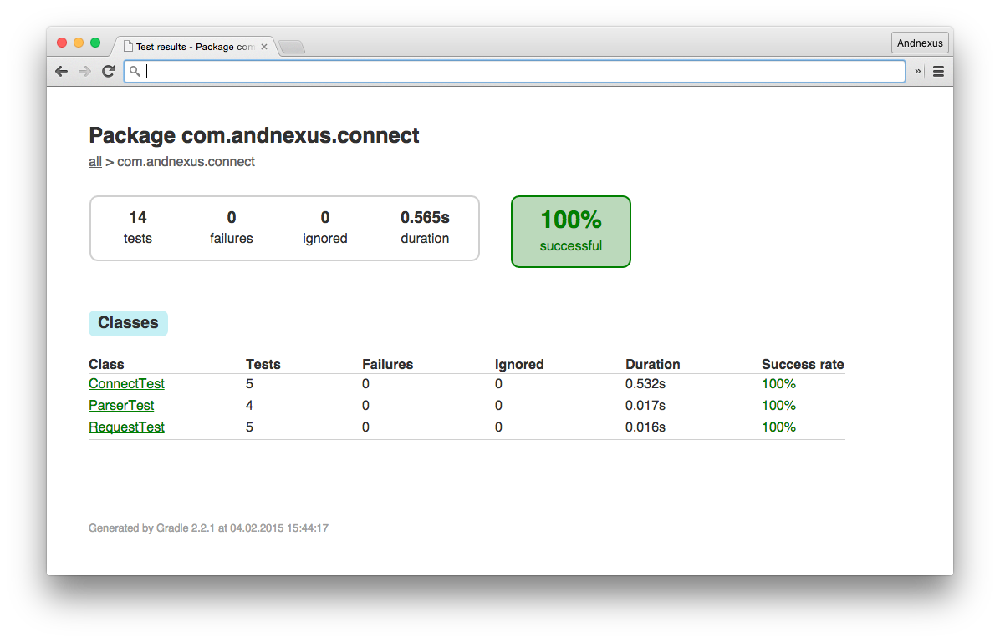
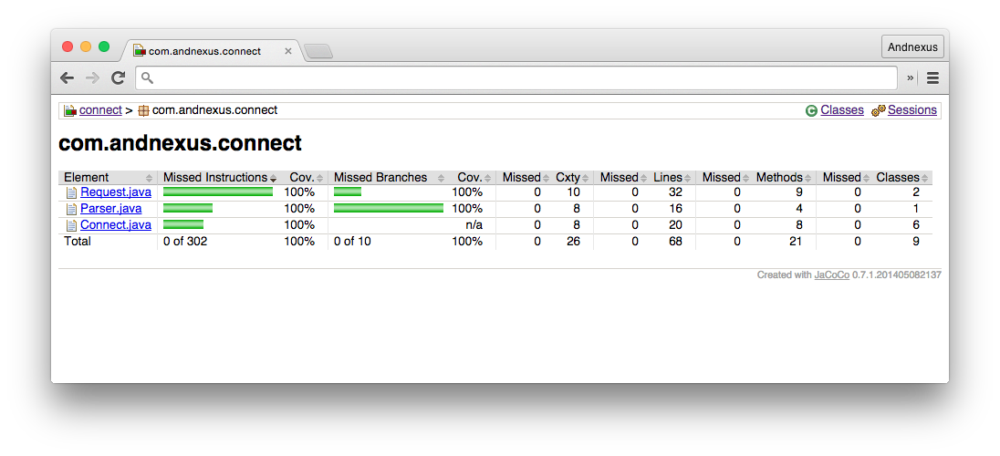

# Automatische Tests für Android


Der Prozess der Qualitätssicherung von Software wird unter anderem durch automatische Testverfahren greifbar. Mit [Dagger](http://google.github.com/dagger), [Mockito](https://code.google.com/p/mockito/) und [Espresso](https://code.google.com/p/android-test-kit) lassen sich Tests für Android entwerfen, die die manuellen Testaufwände drastisch reduzieren können.

[](https://travis-ci.org/andnexus/android-testing)

# Praktisches Beispiel

Eine Webanwendung soll Daten über eine Schnittstelle an eine App ausliefern.

## Backend

Die Webanwendung nach der Java-Servlet-Spezifikation liefert unter dem Pfad ```/backend/data``` das JSON Objekt ```{data:[{"id":123},{"id":456}]}``` aus.

## Model

Das Datenmodell bildet die JSON Struktur in einer Klasse ab.

## Connect

Liefert die Datenmodelle aus der Webanwendung an die App aus.

## App

Android App Komponenten.

## Web

Diese Softwarearchitektur lässt zu, dass mit dem [Google Web Toolkit](http://www.gwtproject.org) die Module Model und Connect in JavaScript übersetzt werden können.

## iOS

Mittels [J2ObjC](https://github.com/google/j2objc) können die Module Model und Connect automatisch auf iOS portiert werden.

# Testplan

## Modultests

Die Java Module Model, Connect und Backend werden mit JUnit4 und unter Einsatz von Mockito getestet.

	./gradlew test
	


Mittels Jacoco lässt sich beim Java Modul Connect eine Testabdeckung von 100% nachweisen.

	./gradlew jacocoTestReport
	


## Android

In der Activity wird z.B. der ConnectivityManager mittels Dagger Dependency Injection bereitgestellt.
	
```
private boolean isOffline() {

  final NetworkInfo activeNetworkInfo = mConnectivityManager.getActiveNetworkInfo();
  return activeNetworkInfo == null || !activeNetworkInfo.isConnected();
}
```
  
Der UI Test mit Espresso ermöglicht das gewünschte Verhalten der App während der unterschiedlichen Verbindungszustände nachzuweisen.

```
public void testShouldDisplayOfflineHint() {
	
  when(mConnectivityManager.getActiveNetworkInfo().isConnected()).thenReturn(false);

  onView(withId(R.id.refresh))
    .perform(swipeDown());
                
  onView(withText(mActivity.getString(R.string.offline)))
    .check(matches(isDisplayed()));
}
```

Die Android Komponenten werden mit plattformeigenen testing APIs, Espresso und JUnit3 getestet.

	./gradlew connectedCheck
	


## Integrationstests

Im Connect-Modul sind für den Gradle Task ```integrationTest``` Tests hinterlegt. Dabei wird zu beginn das Backend gebaut und ist anschließend unter ```http://localhost:8000``` erreichbar. Damit der Task nicht blockiert wird muss folgende Einstellung gesetzt sein.

	org.gradle.daemon=false
	
Mit dem starten des Tasks ```test``` wird automatisch auch der Task ```integrationTest``` angestoßen.

Nach Änderungen am Quellcode werden die Variationen der App, das Connect-Modul und das Backend automatisch [gebaut, gestartet und getestet](https://travis-ci.org/andnexus/android-testing).

## Manuelle Tests

Ein Variant besteht aus Product-Flavor und Build-Type. Variants mit Build-Type Debug sind ausschließlich für automatische Tests vorgesehen. Build-Types vom Typ Release erwarten eine Instanz des Backends hinter der URL oder IP der folgenden Android-Ressource.

	<string name="url_backend">INSERT_YOUR_URI</string>

Ein einfacher Weg ist die folgende Einstellung sicherzustellen

	org.gradle.daemon=true
	
und mit 

	./gradlew jettyRun
	
eine Backend-Instanz zu starten. Dieser Task läuft bis man ihn in der Konsole beendet und lässt manuelle Test in der App zu. Alternativ kann man auch ein Web Application Archive bauen und auf einen Server laden.

# Continuous Delivery

Der letze Schritt ist die Apps zu verteilen. Die [Google Play Publisher API](https://developers.google.com/android-publisher) erlaubt hier automisch Build-Artefakte auf den Stages Alpha, Beta und Production zu platzieren. Damit lassen sich Apps an ausgewählte Tester oder alle Play Store Benutzer verteilen. [Mehr Erfahren...](http://www.andnexus.com)

License
-------

Licensed to the Apache Software Foundation (ASF) under one or more contributor
license agreements.  See the NOTICE file distributed with this work for
additional information regarding copyright ownership.  The ASF licenses this
file to you under the Apache License, Version 2.0 (the "License"); you may not
use this file except in compliance with the License.  You may obtain a copy of
the License at

http://www.apache.org/licenses/LICENSE-2.0

Unless required by applicable law or agreed to in writing, software
distributed under the License is distributed on an "AS IS" BASIS, WITHOUT
WARRANTIES OR CONDITIONS OF ANY KIND, either express or implied.  See the
License for the specific language governing permissions and limitations under
the License.

